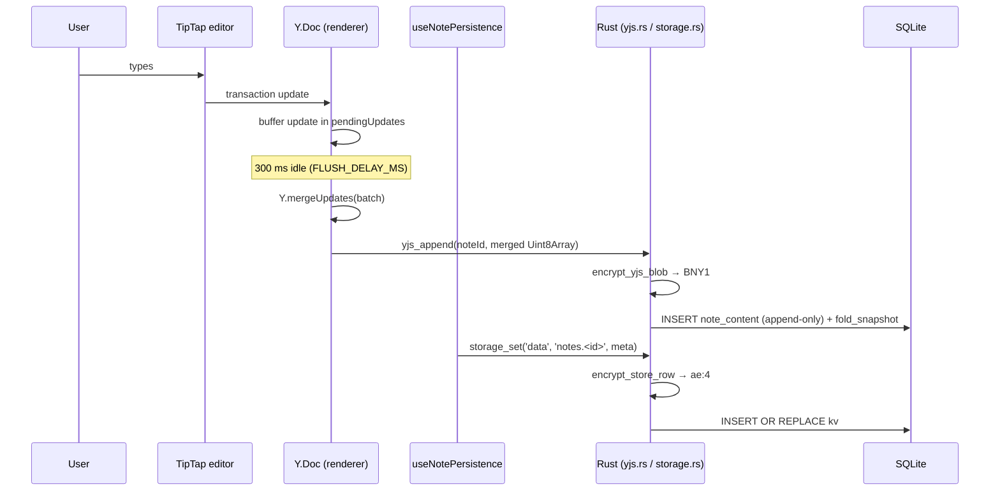
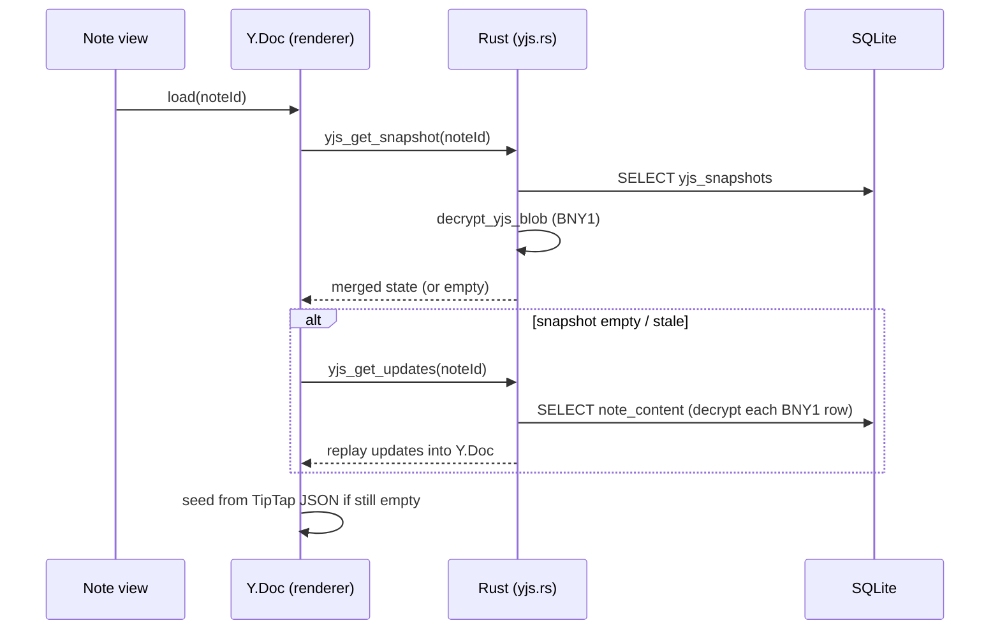
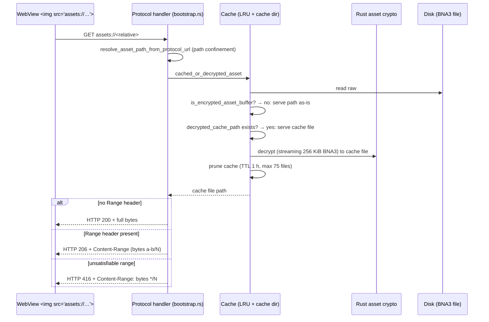
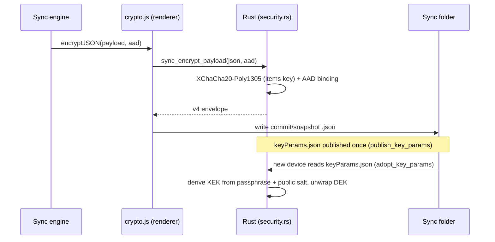
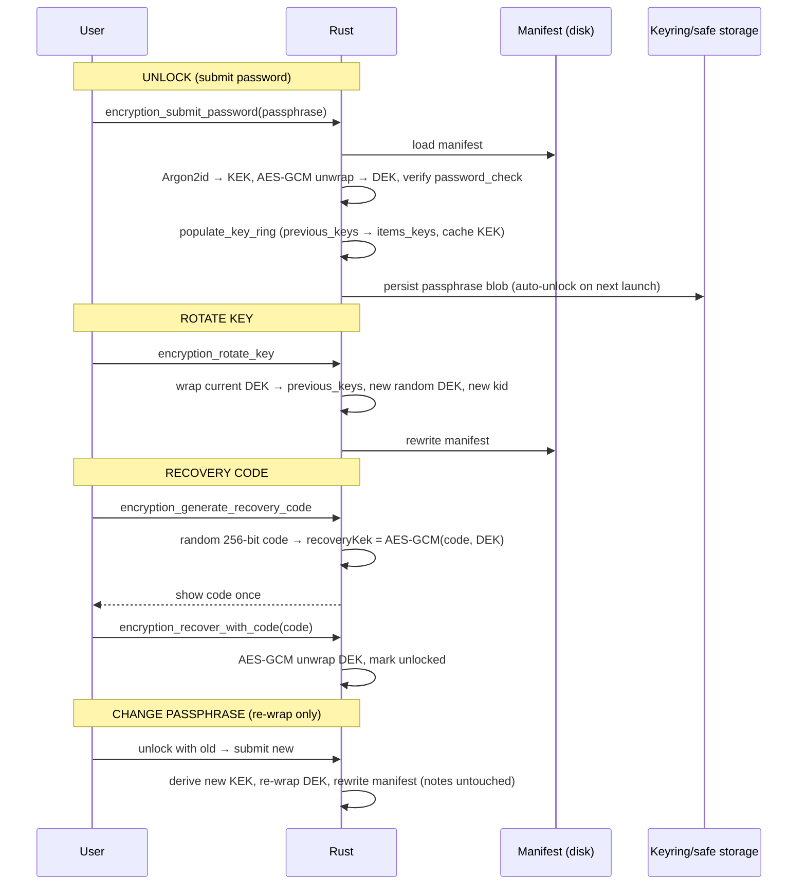

# Beaver Notes — Encryption Architecture

This document describes the **current** encryption system as implemented. It is the
authoritative reference for how keys, envelopes, and encrypted data domains fit
together, and supersedes the (outdated) encryption section of `ARCHITECTURE.md`.

> Last verified: 2026-07-31 against `src-tauri/src/shared/crypto/*`, `commands/security.rs`,
> `commands/storage.rs`, `commands/fs.rs`, `commands/yjs.rs`, `shared/state.rs`, `shared/cache.rs`,
> `secure_blob.rs`, `db.rs`, `bootstrap.rs` and the renderer crypto facade.

---

## 1. Trust boundaries

```
 ┌──────────────────────────────────────────────────────────────────┐
 │ Renderer (V8 / WebView)                                           │
 │  • Holds plaintext note content in memory (Y.Doc, TipTap state)   │
 │  • NEVER holds the KEK or the items key (DEK)                     │
 │  • Sends plaintext payloads to Rust for encryption via Tauri IPC  │
 │  • Receives decrypted plaintext back from Rust for display        │
 └───────────────────────────────┬──────────────────────────────────┘
                                 │  Tauri IPC (JSON-serialized)
                                 ▼
 ┌──────────────────────────────────────────────────────────────────┐
 │ Rust backend (trusted)                                            │
 │  • Sole holder of KEK / DEK while unlocked (CryptoSession)        │
 │  • All at-rest cryptography happens here                          │
 │  • SQLite, assets, sync folder, secure blobs                      │
 └──────────────────────────────────────────────────────────────────┘
```

The renderer sees plaintext while a document is open, and the plaintext crosses
the IPC bridge for encryption/decryption — but the keys never leave Rust.

---

## 2. Key hierarchy

```
 User passphrase
   │
   │  Argon2id (Argon2id v0x13, 16 MiB, 2 iterations, 2 parallelism, 32 B out)
   │  — manifests v3+      [keys.rs: derive_kek_argon2id]
   │  PBKDF2-HMAC-SHA256, 100 000 iterations — legacy manifests v1/v2
   ▼
 KEK  (Key-Encryption-Key, 32 B, in memory only)
   │
   │  AES-256-GCM key-wrap (random 12 B nonce, random 32 B key)
   ▼
 Items Key / DEK  (random 32 B AES key)  ◄── the single data-encryption key
   │
   │  Key ring:  currentKeyId + previousKeys[] (rotation history)
   │  Lookup:    kid on each envelope selects the correct ring key
   │
   ├── XChaCha20-Poly1305  →  note content (ae:3), storage rows (ae:4),
   │                          sync commits/snapshots/genesis
   └── AES-256-GCM         →  Yjs CRDT blobs (BNY1), asset files (BNA3)

 Recovery code (random 256-bit, shown once)
   │  AES-256-GCM wraps the DEK → manifest.recoveryKek
   ▼  unlock without the passphrase

 OS keyring master key  (32 B)   ◄─ service com.beavernotes.beaver-notes
   │  fallback: master.key file (chmod 600)
   │  AES-256-GCM
   ▼
 Secure blobs  →  encryption passphrase (auto-unlock), Beaver account session
```

Key facts:

- **One DEK for everything.** Note content, note metadata, assets, and sync all
  use the same items key. There is no separate "asset key" or "sync key".
- **The DEK is random and wrapped.** The passphrase never encrypts data directly;
  it derives a KEK that only unwraps the stored DEK. Changing the passphrase
  re-wraps the DEK (no data re-encryption).
- **Rotation is lazy.** `rotate_items_key` archives the old key into
  `previous_keys` (wrapped by the KEK) and starts a fresh DEK. Old envelopes stay
  decryptable because their `kid` resolves through the in-memory `items_keys` ring,
  repopulated from `previous_keys` at unlock time.
- **Recovery** stores the DEK wrapped by a random 256-bit code (`recoveryKek`),
  letting a user regain access without the passphrase.

---

## 3. On-disk artifacts

| Artifact | Path | Contents |
|----------|------|----------|
| Encryption manifest | `<appData>/app-crypto/manifest.v2.json` | v4 manifest: KDF params, salts, `passwordCheck`, `wrappedKey`, `currentKeyId`, `previousKeys[]`, `recoveryKek` |
| Shared key params | `<syncPath>/BeaverNotesSync/keyParams.json` | Public salt + wrapped DEK so a second device derives the same key (`publish_key_params` / `adopt_key_params`) |
| Master key (fallback) | `<dataLocal>/com.beavernotes.beaver-notes/master.key` | 32 B base64, chmod 600 — used only when the OS keyring is unavailable |
| Secure blobs | `<dataLocal>/com.beavernotes.beaver-notes/secure_blobs.json` | AES-GCM blobs (keyring preferred, disk fallback) |
| Data store | `<appData>/workspaces/<id>/data.db` | `kv` (ae:4 rows), `note_content` / `yjs_snapshots` (BNY1), `notes_fts` (plaintext index) |
| Settings store | `<appData>/workspaces/<id>/settings.db` | **Plaintext** KV — sync path, prefs, window state |
| Assets | `<appData>/notes-assets/`, `<appData>/file-assets/` | BNA3-encrypted binaries |

`<appData>` resolves via `app_storage_dir` (`shared/mod.rs:312`): the
`BEAVER_NOTES_DATA_DIR` env override, the portable storage dir, or Tauri's
app-data dir. `<dataLocal>` is the OS local-data dir (the app-id dir).

---

## 4. Envelope formats

### 4.1 Note content

Rust-native, produced by `encrypt_note_content_for_storage` / the
`encryption_encrypt_note_payload` command:

```
ae:3   { ae: 3, iv: hex(24 B), cipher: base64, kid: string }
       XChaCha20-Poly1305 · AAD "beaver-notes:note-content:v1" (NOTE_AAD)
ae:2   { ae: 2, iv: hex(12 B), cipher: base64 }      ← legacy AES-256-GCM
ae:1   { ae: 1, ... }                                ← legacy renderer envelope
```

Detection: `isEncryptedContent` / `note_content_is_native_encrypted`
(`ae` ∈ {2, 3} with `iv` + `cipher`). `kid` absent → current key (legacy).

### 4.2 Storage rows (KV metadata)

```
ae:4   { ae: 4, v: 4, iv: hex(24 B), enc: base64, kid: string }
       XChaCha20-Poly1305 · AAD "beaver-notes:data-store:<rowKey>" (storage_aad)
```

Applied by `encrypt_store_row` / `decrypt_store_row` (`commands/storage.rs:118`).
Every `data.db` KV row (e.g. `notes.<id>`, `labels`, `deletedIds`) is wrapped
when app encryption is enabled **and** the key is loaded. Rows written while
locked/unconfigured are stored plaintext and transparently upgraded on read
(`load_store_root` migration pass).

### 4.3 Assets

```
BNA3   b"BNA3" || nonce_seed(12 B) || (u32 len ‖ ciphertext ‖ tag)*
       AES-256-GCM per chunk (256 KiB); chunk nonce =
         HMAC-SHA384(DEK, nonce_seed ‖ "BeaverNotes-asset-chunk" ‖ LE64(chunk_index))[..12]
BNA2   b"BNA2" || iv(12) || tag(16) || ciphertext     ← legacy single-shot
BNA1   b"BNA1" || iv(12) || tag(16) || ciphertext     ← legacy single-shot
```

Streaming encryption/decryption in `shared/crypto/assets.rs`
(`encrypt_asset_streaming` / `decrypt_asset_streaming`); small buffers use the
in-memory `encrypt_asset_bytes_with_key` variant.

### 4.4 Yjs CRDT blobs

```
BNY1   b"BNY1" || nonce(12 B) || ciphertext     AES-256-GCM
```

Applies to every row in `note_content` and `yjs_snapshots` while app encryption
is active and unlocked (`db.rs: yjs_append/compact/write_snapshot`). Blobs
without the magic are legacy plaintext and returned as-is.

### 4.5 Sync payloads

```
v4     { v: 4, iv: hex(24 B), enc: base64 }     XChaCha20-Poly1305
```

Produced by `sync_encrypt_payload`; AAD binds each payload to its identity
(`sync-yjs.js:173/191` uses `${noteId}-${ts}`, `${docId}-snapshot-${ts}`).
Cross-device keys come from `keyParams.json` (Section 2).

### 4.6 Secure blobs (safe storage)

```
base64( iv(12 B) ‖ AES-256-GCM(masterKey, plaintext) )
```

`safe_storage_encrypt_bytes` / `safe_storage_decrypt_bytes` (`keys.rs:913`).

---

## 5. Algorithms inventory

| Primitive | Used for | Where |
|-----------|----------|-------|
| AES-256-GCM | Key wrap, safe-storage blobs, legacy ae:2 note content, BNA1/2/3 assets, BNY1 Yjs blobs | Rust (`aes-gcm`) |
| XChaCha20-Poly1305 | ae:3 note content, ae:4 storage rows, sync v4 payloads | Rust (`chacha20poly1305`) |
| Argon2id (v0x13, 16 MiB/2/2) | Passphrase → KEK (manifest v3+) | Rust (`argon2`) |
| PBKDF2-HMAC-SHA256 (100k) | Passphrase → KEK (manifest v1/v2); legacy per-note v2 lock | Rust / JS worker |
| HMAC-SHA384 | BNA3 per-chunk nonce derivation | Rust |
| Bcrypt (cost 10) | Account-password hash/verify (`passwd_hash` / `passwd_compare`) | Rust (`bcrypt`) |
| MD5 (EVP_BytesToKey) + AES-256-CBC | Legacy CryptoJS per-note lock — migration only | Rust (`shared/crypto/legacy.rs`) |
| WebCrypto AES-GCM (ML-KEM-derived key) | Collaboration updates (`utils/crypto/collab.js`) | JS (`crypto.subtle`) |
| PBKDF2 + AES-GCM | Legacy v2 per-note password migration | JS (`crypto.subtle`, `legacyElectron.js`) |

---

## 6. Data domains and what is (not) encrypted at rest

| Domain | At rest | Envelope | Encrypted when |
|--------|---------|----------|----------------|
| Note content (Yjs updates/snapshots) | ✅ | BNY1 | app encryption enabled + unlocked |
| Note metadata (title, labels, folder, …) | ✅ | ae:4 | app encryption enabled + unlocked |
| Non-note KV (`labels`, `deletedIds`, …) | ✅ | ae:4 | app encryption enabled + unlocked |
| Assets (`notes-assets`, `file-assets`) | ✅ | BNA3 | app encryption enabled + unlocked, path under asset roots |
| Sync folder commits/snapshots | ✅ | v4 + AAD | app encryption enabled |
| Secure blobs (passphrase, account) | ✅ | AES-GCM (master key) | always (keyring/0600 file) |
| Collaboration updates | ✅ | AES-GCM (collab key) | collab active |
| `settings.db` KV | ❌ **plaintext** | — | never |
| `notes_fts` (FTS5 search index) | ❌ **plaintext** | — | never |
| macOS Spotlight index | ❌ **plaintext** | — | never |

The plaintext exceptions are intentional (search) and should be understood as a
trade-off: anyone with raw filesystem access to the workspace can read indexed
title/body snippets even with encryption enabled.

---

## 7. Lifecycle flows

### 7.1 Note save (typing → SQLite)



Batching that already exists:

- `useNoteYjs.js` buffers updates and flushes a `Y.mergeUpdates` batch after
  **300 ms** of idle, and hard-flushes on note switch/unmount.
- `useNotePersistence.js` coalesces metadata writes with a second **300 ms**
  debounce and a single-in-flight promise.
- `pending-writes.js` queues sync-folder commit writes until the next sync cycle
  (steady-state ~1 write/cycle instead of ~200/min of active typing).
- Note switch/unmount runs `yjs_compact` to collapse history into one snapshot row.

### 7.2 Note load



### 7.3 Asset fetch (`assets://`)



> **Memory model (2026-07):** the handler decrypts to a cache file, then serves
> it from disk. Requests with a `Range` header get only the requested slice
> (`206 Partial Content`, `Content-Range`, `Accept-Ranges: bytes`), so media
> elements and streaming readers never force a whole decrypted asset into
> memory; plain no-`Range` requests still buffer the full file in one shot.

### 7.4 Background sync



### 7.5 Unlock, rotation, recovery, passphrase change



Lock = reset `CryptoSession` to default (drop DEK/KEK/ring). Failed attempts are
rate-limited: **5 consecutive failures → lockout**, extended per failure, capped
at **300 s** (`LOCKOUT_THRESHOLD/BASE/MAX_SECS`).

---

## 8. JS ↔ Rust boundary (crypto-facing commands)

All commands are exposed via `lib/native/security.js` → `tauri-bridge` and are
specta-typed in `src/lib/tauri/bindings.ts`. Raw `Vec<u8>` (Yjs updates,
snapshots) is serialized by Tauri 2 as a JSON `number[]` — there is no zero-copy
invoke-argument path; only protocol *responses* can stream raw bytes.

| Tauri command | JS wrapper | Payload across IPC |
|---------------|-----------|--------------------|
| `encryption_get_state` | `getEncryptionState` | `{enabled, unlocked}` |
| `encryption_submit_password` | `submitEncryptionPassword` | passphrase (setup or unlock) |
| `encryption_enable` / `encryption_unlock` / `encryption_lock` | `enableEncryption` / `unlockEncryption` / `lockEncryption` | passphrase / none |
| `encryption_encrypt_note_payload` | `encryptNotePayload` | **plaintext JSON** → ae:3 envelope |
| `encryption_decrypt_note_payload` | `decryptNotePayload` | ae:3 envelope → plaintext JSON |
| `encryption_rotate_key` | `rotateEncryptionKey` | none |
| `encryption_generate_recovery_code` / `encryption_recover_with_code` | `generateRecoveryCode` / `recoverWithCode` | code hex |
| `encryption_reconcile_key_params` | `reconcileSyncKeyParams` | optional passphrase |
| `sync_encrypt_payload` / `sync_decrypt_payload` | `syncEncryptPayload` / `syncDecryptPayload` | plaintext JSON → v4 envelope / reverse |
| `sync_key_ready` | `syncKeyReady` | bool |
| `safe_storage_*` | `encryptString` / `decryptString` / `storeSecureBlob` / `fetchSecureBlob` / `clearSecureBlob` / `isEncryptionAvailable` | base64 blobs |
| `asset_crypto_migrate_dir` | `migrateAssetEncryption` | progress events |
| `asset_crypto_set_passphrase` / `clear_passphrase` | `setAssetPassphrase` / `clearAssetPassphrase` | transient passphrase (migration) |
| `assetCrypto:decryptAssetStream` / `encryptAssetStream` | `decryptAssetStream` / `encryptAssetStream` | asset path → decrypted cache path |
| `crypto:cacheDecryptedNote` / `getCachedDecryptedNote` / `clearDecryptedCaches` | `cacheDecryptedNote` / `getCachedDecryptedNote` / `clearDecryptedCaches` | note id + bytes |
| `crypto:decryptLegacyNote` | `decryptLegacyCryptoJSNote` | CryptoJS migration |
| `crypto:deriveArgon2Key` | `deriveArgon2Key` | legacy per-note lock migration |
| `passwd:hash` / `passwd:compare` / `passwd:recordFailure` / `passwd:resetFailures` | `hashPassword` / `comparePassword` / `recordPasswordFailure` / `resetPasswordFailures` | account passwords |
| `yjs_append` / `yjs_get_snapshot` / `yjs_get_updates` / `yjs_compact` | `appendUpdate` / `getSnapshot` / `getUpdates` / `compactUpdates` | `number[]` binary blobs |

---

## 9. File index

### Rust (all crypto lives here)

| File | Responsibility |
|------|----------------|
| `src-tauri/src/shared/crypto/keys.rs` | Manifest struct + I/O, Argon2id/PBKDF2 KDFs, KEK↔DEK wrap/unwrap, key ring + `key_for_id`, rotation, recovery codes, safe-storage AES-GCM, ae:2/ae:3 note content, `keyParams.json` publish/adopt |
| `src-tauri/src/shared/crypto/assets.rs` | BNA1/2/3 asset streaming + in-memory AES-GCM, BNY1 Yjs blobs, `is_encrypted_*` detection |
| `src-tauri/src/shared/crypto/legacy.rs` | CryptoJS AES-256-CBC + MD5 EVP_BytesToKey (one-time migration) |
| `src-tauri/src/shared/crypto/mod.rs` | Module glue, `KEYRING_AVAILABLE` flag |
| `src-tauri/src/shared/crypto/tests.rs` | KDF characterization vector, envelope round-trips |
| `src-tauri/src/commands/security.rs` | All crypto Tauri commands (unlock/lock/rotate/recovery/reconcile/sync-payload/safe-storage/asset-migration/passwd/lockout) |
| `src-tauri/src/commands/storage.rs` | ae:4 row encryption for `data.db` KV + plaintext→encrypted migration |
| `src-tauri/src/commands/fs.rs` | `fs_write_file`/`fs_copy`/`fs_read_data` asset encryption hooks |
| `src-tauri/src/commands/yjs.rs` | Plumbs `app_data_key` into Yjs blob storage |
| `src-tauri/src/shared/state.rs` | `CryptoSession` (DEK, items ring, cached KEK, active), `SecurityState` (lockout, transient passphrase), `CacheState`, `CryptoState` |
| `src-tauri/src/shared/cache.rs` | Decrypted-note (64 MB) + decrypted-asset (128 MB) byte LRUs |
| `src-tauri/src/secure_blob.rs` | Secure-blob store (memory + keyring + encrypted disk fallback) |
| `src-tauri/src/shared/mod.rs` | `app_encryption_manifest_path`, `decrypted_cache_path`, `cached_or_decrypted_asset`, path access control, constants |
| `src-tauri/src/bootstrap.rs` | Startup: sets `session.active` from manifest existence; `assets://` / `file-assets://` protocol handlers |
| `src-tauri/src/db.rs` | `yjs_append/compact/snapshot` with BNY1 encryption, FTS index |

### Renderer

| File | Responsibility |
|------|----------------|
| `src/utils/crypto/encryption.js` | Facade: `setupEncryption`, `verifyPassphrase`, `tryRestoreKeyFromSafeStorage`, `encryptContent`/`decryptContent`, `lockEncryptionKey`, recovery helpers |
| `src/utils/crypto/safeStorageBlob.js` | Persist/load the passphrase blob via safe storage (auto-unlock) |
| `src/utils/crypto/codec.js` | hex/base64 encoding helpers (no crypto) |
| `src/utils/crypto/constants.js` | Shared renderer crypto constants |
| `src/utils/crypto/collab.js` | Collaboration AES-GCM (WebCrypto, ML-KEM-derived key from Beaver-Sync backend) |
| `src/utils/sync/crypto.js` | `encryptJSON`/`decryptJSON` → Rust `sync_encrypt/decrypt_payload`, `KEY_LOCKED`/`DECRYPT_FAILED` errors, `.enc` asset naming |
| `src/utils/sync/sync-yjs.js` | Per-commit/snapshot AAD binding, remote update read-back |
| `src/utils/note/serializer.js` | `decryptNoteForMemory`, `hydrateNote`, `extractTextFromContent` |
| `src/store/note/encryption.ts` | Bulk decrypt/encrypt for toggling app encryption (Security settings) |
| `src/composable/useNoteEncryption.js` | Unlock flow (biometrics → safe-storage restore → passphrase dialog) |
| `src/lib/native/security.js` | Tauri command wrappers for the whole table in §8 |
| `src/pages/settings/Security.vue` | Encryption settings UI (enable/disable, change passphrase, rotate, recovery code, asset migration) |
| `src/pages/Onboarding.vue` | Onboarding encryption setup |

---

## 10. Already-shipped optimizations and known gaps

### Already shipped

- **Debounced/batched Yjs persistence** — 300 ms coalescing + `Y.mergeUpdates`
  (`useNoteYjs.js`), metadata debounce (`useNotePersistence.js`), sync-write
  queue (`pending-writes.js`).
- **Snapshot compaction** — `yjs_compact` on note switch/unmount; incremental
  `fold_snapshot` keeps reads O(1).
- **LRU decrypted caches** — notes 64 MB, assets 128 MB, plus a decrypted-asset
  cache dir (TTL 1 h, 75 files) keyed by path+mtime+size.
- **Streaming asset decrypt** — BNA3 decrypts chunk-by-chunk to a cache file
  instead of materializing the whole plaintext at once.
- **Key retention on rotation** — `previous_keys` + `kid` lookups make rotation
  non-destructive to old notes.
- **Zeroize on session drop** — `CryptoSession` zeroizes KEK/DEK/items-key ring
  via its `Drop` impl; passphrase/asset-key cache cleared through zeroizing
  mutators in `state.rs`.
- **HTTP range responses on `assets://`** — `Accept-Ranges: bytes` + `206
  Partial Content`/`Content-Range` (and `416` for unsatisfiable ranges) so
  media elements and `fetch`-based readers can seek/stream without loading a
  whole decrypted file into memory.
- **Worker surface removed** — `utils/crypto/worker.js` and the `*OnWorker`
  codec exports are gone; legacy v2 migration now derives its PBKDF2 key
  inline with `crypto.subtle`. No renderer crypto remains off-thread.

### Known gaps (candidates for future work)

- **Zeroize coverage is partial** — `CryptoSession` (KEK/DEK/items-key ring) and
  the transient asset passphrase are scrubbed on drop/lock/clear, but copies of
  `[u8; 32]` keys that escape the session (locals in `keys.rs`, yjs wrappers)
  are not wrapped in `Zeroizing`; full coverage needs a `secrecy`-style pass.
- **`assets://` full-buffer on no-range requests** — range/`206` responses are
  now supported (`Accept-Ranges: bytes`, `Content-Range`), so media seeking and
  streaming readers avoid full loads, but a plain no-`Range` request still
  buffers the whole decrypted file.
- **Tauri IPC serializes `Vec<u8>` as JSON `number[]`** (~3–4× bloat) — platform
  constraint; only large snapshots are affected, keystroke-size merges are not.
- **Collaboration crypto is JS** (`collab.js`, WebCrypto) — ML-KEM lives on the
  backend; per-update AES-GCM runs in V8 rather than Rust.
- **Plaintext search indexes** — FTS5 and Spotlight index note text in plaintext.
- **`master.key` fallback file** — weaker than the OS keyring (still 0600).

---

## 11. Security configuration knobs

| Setting | Value | Location |
|---------|-------|----------|
| Argon2id memory | 16 MiB | `keys.rs: ARGON2_MEMORY_KIB` |
| Argon2id iterations / parallelism | 2 / 2 | `keys.rs` |
| PBKDF2 iterations (legacy) | 100 000 | `keys.rs: PBKDF2_ITERATIONS` |
| Manifest version / sync protocol | 4 / 4 | `keys.rs` |
| Stream chunk size | 256 KiB | `keys.rs: STREAM_CHUNK_SIZE` |
| Lockout | 5 failures → 30 s, capped 300 s | `shared/mod.rs` |
| Decrypted caches | 64 MB notes / 128 MB assets | `shared/cache.rs` |
| Asset cache dir | TTL 1 h, max 75 files | `shared/mod.rs` |
