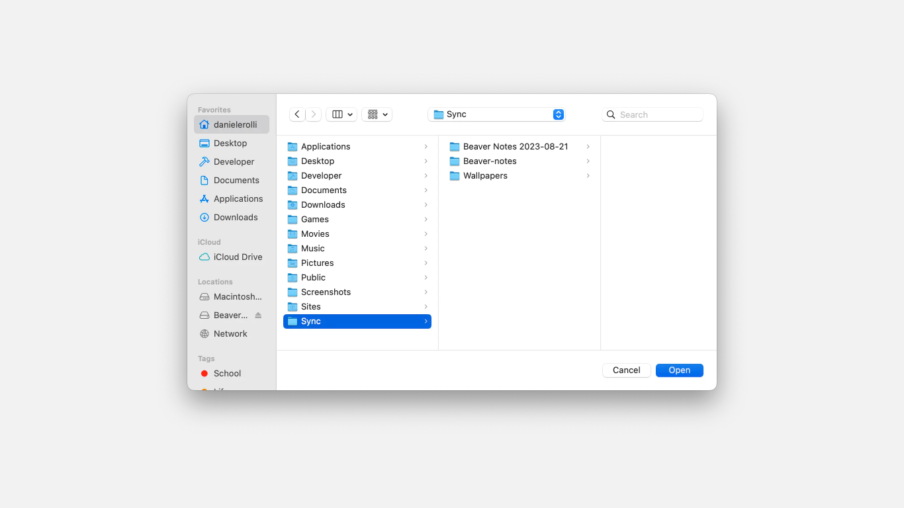

# 🔄 Set up the Sync


Before we get started, ensure that you have a cloud provider such as Dropbox, OneDrive, iCloud, etc., installed on your PC. If you don't have a cloud provider installed on your PC, simply search **'\[Your Cloud Provider Name] + Your Operating System'** on Google. Alternatively, you can also explore services like Syncthing or utilize your own server if you happen to have on.


To sync your notes across devices, you'll need to choose the folder on your PC where you want your notes to be stored for synchronization. This folder should be located within a cloud provider or syncing service folder, such as iCloud, OneDrive, or Syncthing. After setting up this path, you can easily import and export your notes by clicking the corresponding buttons in the sidebar. We recommend toggling the 'import' button as soon as you open the app and doing the same with the 'export' button before concluding your note-taking session.

Selecting the path

To choose the path, head to settings > General  > Sync Path > Select Path

<figure><figcaption></figcaption></figure>

After clicking 'Select Path,' your file manager window will open. Simply choose the folder where you want your notes to be synced.

<figure><figcaption></figcaption></figure>

Once you've selected the path, the app will reload for the changes to take effect, and you'll be taken back to the editor. From there, you can either press the two buttons in the sidebar to import and export your notes or just press Ctrl/Cmd+Shift+U to import and Ctrl/Cmd+Shift+E to export.


"If the buttons in the sidebar or the shortcuts don't work the first time, try accessing settings and exporting your data manually. After that, both the buttons and the shortcuts should work.

